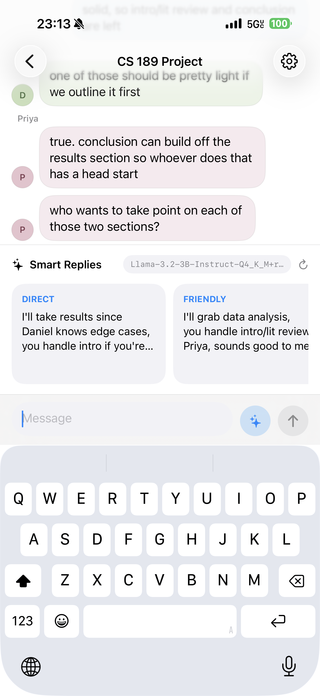
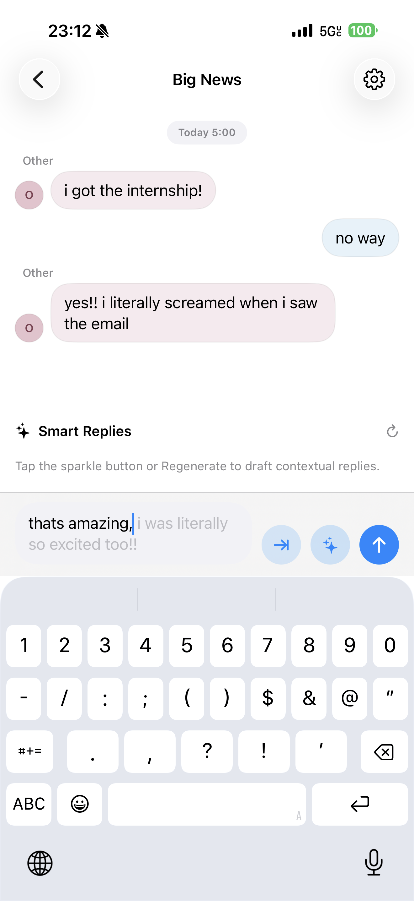
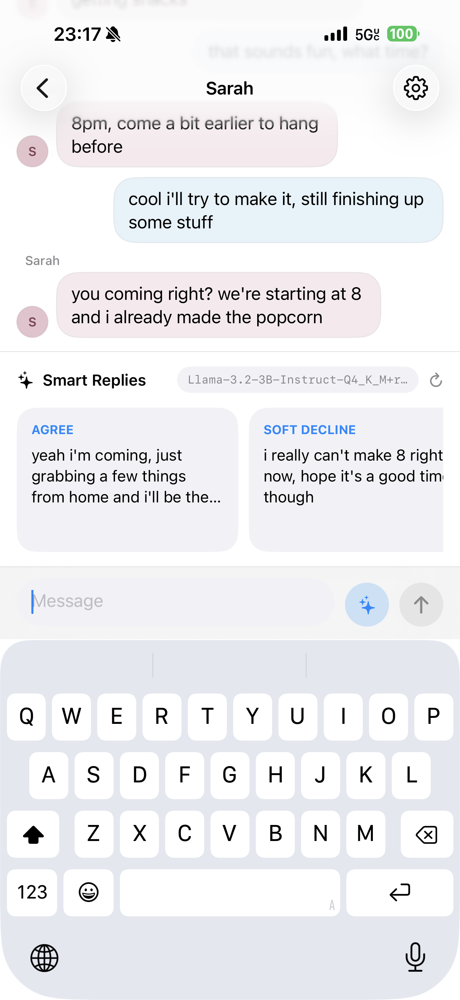
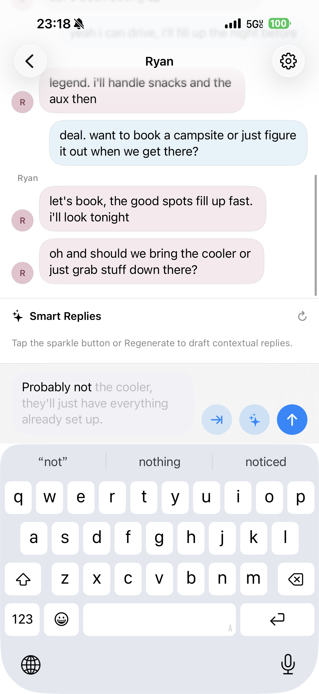
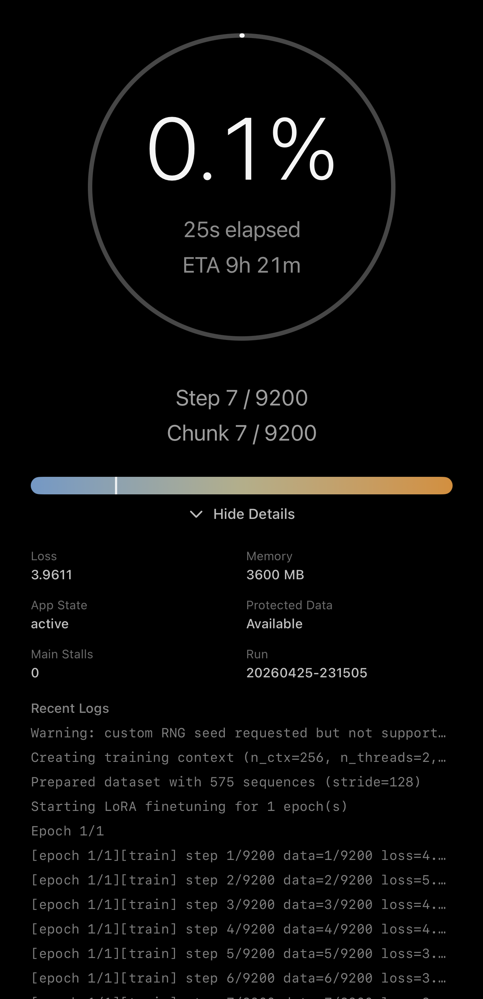

# Social-Draft - A Personal Reply Assistant and On-Device Autopilot

Social Draft is a real-time communication copilot for the awkward moments when someone receives a message and does not know how to reply. It is not a chatbot. Instead of trying to become another person in the conversation, Social Draft stays beside the user, reads the recent context, understands the user's rough intent, and helps them navigate the moment with replies that feel natural, considerate, and easy to send.

The iOS app is built around an on-device-first experience: the core communication copilot can run entirely on the user's device with a bundled GGUF model and optional LoRA adapter. For development and evaluation, the project also includes cloud and mock backends so model behavior can be compared safely.

The repository also contains the supporting research pipeline: Python benchmarking tools, Claude-based data distillation scripts, sample dialogue data, and a LoRA/SFT training path that can feed adapters back into the app.


## Screenshot Carousel

<table>
  <tr>
    <td align="center" width="20%">
      <a href="docs/screenshots/1.PNG">
        
      </a>
      <br>
      <sub>Context-aware smart replies</sub>
    </td>
    <td align="center" width="20%">
      <a href="docs/screenshots/2.PNG">
        
      </a>
      <br>
      <sub>Inline ghost completion</sub>
    </td>
    <td align="center" width="20%">
      <a href="docs/screenshots/3.PNG">
        
      </a>
      <br>
      <sub>Decision-aware suggestions</sub>
    </td>
    <td align="center" width="20%">
      <a href="docs/screenshots/4.PNG">
        
      </a>
      <br>
      <sub>Draft continuation</sub>
    </td>
    <td align="center" width="20%">
      <a href="docs/screenshots/5.PNG">
        
      </a>
      <br>
      <sub>On-device LoRA training</sub>
    </td>
  </tr>
</table>

Click any screenshot to open the full-size image.

## Quick start

1. **Clone this repository** (application + tooling):

   ```bash
   git clone https://github.com/MingxuanGao661/Reply-Recommendation-Demo.git
   cd Reply-Recommendation-Demo
   ```

2. **Pull published weights, LoRA, and data from Hugging Face** (base chat model + reply assets in one place):

   ```bash
   git clone https://huggingface.co/Williamgao6021/social-draft-llama-3.2-3b
   ```

   Use the files inside that clone as the source for `.gguf` (and any bundled JSONL / adapter files you ship with the app). For **Local** mode in Xcode, add the required `.gguf` names to **Copy Bundle Resources** so they match `AppSettingsStore` (see [Local Inference](#local-inference)); large binaries are intentionally omitted from git.

3. **Python tooling (optional, for benchmarks / distillation / SFT notebooks)**:

   ```bash
   python3 -m venv .venv
   source .venv/bin/activate
   pip install -r requirements.txt
   ```

4. **Run the iOS app**: open `Reply Recommendation Demo/Reply Recommendation Demo.xcodeproj` in Xcode, select the **Reply Recommendation Demo** scheme, choose a simulator or device, then **Run** (`Cmd+R`). Mock mode works without any model files; Local mode needs the bundled GGUF paths above.

## What This Project Does

At the product level, Social Draft behaves like a private reply copilot inside a messaging experience:

- Displays seeded or live demo chat threads with multiple participants.
- Helps when the user has received a message but is unsure how to respond.
- Lets the user write a rough draft, select a message to reply to, or ask for suggestions from the current conversation context.
- Generates suggestion cards such as natural, direct, friendly, thoughtful, or decision-oriented replies.
- Supports an inline "ghost text" completion while typing.
- Lets the user switch between Local, Cloud, and Mock suggestion backends.
- Can apply a bundled LoRA adapter or a user-trained personal LoRA adapter for local inference.
- Includes a local training screen for a conservative on-device LoRA smoke test.
- Uses Supabase for demo thread storage, live messages, realtime inserts, polling fallback, and message deletion.

At the research/tooling level, the repo supports:

- Local and cloud model benchmarking against the same reply schema.
- Synthetic social-reply dataset creation through a two-phase Claude distillation flow.
- Sample dialogue conversion and preprocessing utilities.
- LoRA/SFT notebook training for Llama-style chat data.
- Design notes for the Swift frontend, streaming cards, inference runtime, and training integration.

## Repository Layout

```text
.
├── Reply Recommendation Demo/
│   ├── Reply Recommendation Demo.xcodeproj
│   ├── Reply Recommendation Demo/
│   │   ├── AppRootView.swift
│   │   ├── Features/
│   │   │   ├── Chat/
│   │   │   ├── Common/
│   │   │   └── Settings/
│   │   ├── Backend/
│   │   │   ├── LLMService.swift
│   │   │   ├── CloudService.swift
│   │   │   ├── PromptBuilder.swift
│   │   │   ├── OutputParser.swift
│   │   │   └── TrainingBridge/
│   │   └── Core/Networking/
│   ├── Reply Recommendation Demo Tests/
│   └── *.md design and integration notes
├── Experiments_Benchmarks/
│   ├── demo.py
│   ├── engine_local.py
│   ├── engine_cloud.py
│   ├── evaluator.py
│   └── schemas.py
├── Distillation/
│   ├── distill_claude_social.py
│   ├── social_distill/
│   ├── scripts/
│   └── tools/
├── SFT/
│   ├── train_lora_reply_sft.ipynb
│   ├── prompts_for_sft.py
│   └── requirements.txt
├── sample_dialogue_data/
├── supabase/migrations/
├── docs/
└── requirements.txt
```

## Product Experience

Social Draft is designed for moments that are common in real conversations:

- A friend asks for plans, but the user is tired and wants to respond without sounding cold.
- Someone sends an invite, and the user needs a soft decline.
- A conversation becomes emotionally loaded, and the user wants a reply that is honest but not harsh.
- A workplace or school thread needs a concise, polite answer.
- The user knows what they mean, but the wording feels awkward.

The app does not send autonomous messages and does not impersonate the user. It proposes options, keeps the user in control, and lets the final reply remain their choice.


## iOS App

The iOS app is the main Social Draft surface. It is built in SwiftUI and organized around a few clear layers:

- `AppRootView` wires shared settings and the thread list into the workspace.
- `Features/Chat` owns the thread list, chat screen, composer, reply target banner, suggestion shelf, and demo message records.
- `Features/Settings` exposes backend selection, cloud settings, local model settings, LoRA settings, training controls, thread style, and privacy notes.
- `Features/Common` contains shared settings, reply engine orchestration, inline formatting, and Melange inline support.
- `Backend` contains prompt construction, output parsing, model schemas, local llama.cpp inference, cloud API inference, and on-device training.
- `Core/Networking` contains the Supabase client and JSON coders.

### Backends

The app supports three suggestion modes. Local mode is the direction for the privacy-first product experience; Cloud and Mock modes are useful for development, comparison, and demos.

| Mode | Purpose |
| --- | --- |
| `Mock` | Default safe mode. Produces deterministic suggestions without requiring model files or API keys. |
| `Cloud` | Calls provider APIs from the app using `URLSession`. Supported providers are OpenAI, Anthropic, Gemini, Groq, and OpenRouter. |
| `Local` | Loads bundled GGUF files through the vendored QVAC `llama.xcframework`, optionally with a bundled or user-trained LoRA adapter. |

Cloud defaults are defined in `CloudService.swift`. Local model names and LoRA resource names are defined in `AppSettingsStore.swift`; the referenced `.gguf` files must be included in the app target's Copy Bundle Resources for Local mode to work.

### Local Inference

Local inference is handled by `LLMService.swift` through the C API exposed by `Vendor/QVAC/llama.xcframework`. It:

- Loads a GGUF base model.
- Optionally mounts a LoRA adapter.
- Uses llama.cpp sampler chains for top-k, top-p, temperature, and distribution sampling.
- Tracks latency, token counts, and memory deltas.
- Parses generated text back into the normalized suggestion JSON shape.
- Maintains prompt-prefix token caching for repeated prompt structure.

The current app settings expect these bundled model resource names:

- `Llama-3.2-1B-Instruct-Q4_K_M`
- `Llama-3.2-3B-Instruct-Q4_K_M`
- `reply_sft_lora_v1` for the bundled reply LoRA adapter

Large GGUF files are usually not practical to keep in source control. If Local mode fails with a missing model error, verify that the required `.gguf` files exist and are included in the Xcode target.

### Cloud Inference

Cloud inference uses the same prompt and output contracts as local inference. OpenAI-compatible providers are called through `/chat/completions`; Anthropic uses the native `/messages` API.

Supported providers:

- OpenAI
- Anthropic
- Gemini through its OpenAI-compatible endpoint
- Groq
- OpenRouter

API keys are entered in the app's Cloud settings. The code also supports provider-specific default model names in `CloudService.swift`.

### Supabase Demo Chat

The demo chat service reads and writes thread state through Supabase tables created by the migrations in `supabase/migrations`.

Main capabilities:

- Fetch thread list, participants, and messages.
- Create live demo threads.
- Send and delete messages.
- Subscribe to realtime inserts and deletes.
- Poll as a fallback for new messages.

`SupabaseClientProvider.swift` contains the Supabase URL and resolves the anon key from:

1. `SOCIALDRAFT_SUPABASE_ANON_KEY` in the process environment,
2. `SOCIALDRAFT_SUPABASE_ANON_KEY` in the app Info.plist,
3. the bundled demo anon key in source.

For a private deployment, use your own Supabase project and replace the URL/key path instead of relying on the demo project.

## Running the iOS App

Requirements:

- macOS with Xcode installed.
- iOS Simulator or a physical iOS device.
- Swift Package resolution enabled for the Xcode project.
- Model files only if you want to use Local mode.
- Cloud API key only if you want to use Cloud mode.

Open the project:

```bash
open "Reply Recommendation Demo/Reply Recommendation Demo.xcodeproj"
```

Then select the `Reply Recommendation Demo` scheme and run it from Xcode.

From the command line, a typical simulator build/test flow is:

```bash
xcodebuild \
  -project "Reply Recommendation Demo/Reply Recommendation Demo.xcodeproj" \
  -scheme "Reply Recommendation Demo" \
  -destination "platform=iOS Simulator,name=iPhone 17 Pro" \
  test
```

If your simulator name differs, run `xcrun simctl list devices available` and choose an installed device.

## Distillation, SFT, and benchmarking

End-to-end, the research side is: **synthetic / teacher-distilled dialogue → JSONL rows → LoRA SFT (notebook or on-device smoke) → same schema benchmarks in Python or the app.**

| Stage | Location in repo | Hugging Face |
| --- | --- | --- |
| **Distillation** | `Distillation/` — `distill_claude_social.py`, `social_distill/`, `tools/` | Teacher-generated rows and merged datasets can be versioned alongside the [HF hub repo](https://huggingface.co/Williamgao6021/social-draft-llama-3.2-3b). |
| **SFT / LoRA** | `SFT/` — `train_lora_reply_sft.ipynb`, `prompts_for_sft.py` | Export adapters (e.g. `reply_sft_lora_v1`-style GGUF) and publish under the same hub for reproducible training. |
| **Benchmark** | `Experiments_Benchmarks/` — `demo.py`, `engine_local.py`, `engine_cloud.py`, `evaluator.py` | Point local engines at GGUF files from `git clone https://huggingface.co/Williamgao6021/social-draft-llama-3.2-3b`; results land under `Experiments_Benchmarks/results/`. |

Quick clone of all published model + data artifacts:

```bash
git clone https://huggingface.co/Williamgao6021/social-draft-llama-3.2-3b
```

## Python Benchmarking Tools

The `Experiments_Benchmarks` folder is the standalone prototype and benchmark harness. It exercises the same communication-copilot schema outside the app. Published base weights and companion files for local runs live on [Hugging Face — `Williamgao6021/social-draft-llama-3.2-3b`](https://huggingface.co/Williamgao6021/social-draft-llama-3.2-3b) (clone with `git` as in [Quick start](#quick-start)).

Create a virtual environment from the repo root:

```bash
python3 -m venv .venv
source .venv/bin/activate
pip install -r requirements.txt
```

Run the benchmark CLI from its folder:

```bash
cd Experiments_Benchmarks
python demo.py cloud --provider anthropic --limit 3
python demo.py local --model Llama-3.2-1B-Instruct-Q4_K_M.gguf --limit 3
python demo.py benchmark --limit 3
```

The local engine searches for `.gguf` files in several model locations, including the app bundle folder and `Experiments_Benchmarks/models`. Results are written under:

- `Experiments_Benchmarks/results/Reply/`
- `Experiments_Benchmarks/results/Eval/`

Cloud mode reads API keys from `.env` in `Experiments_Benchmarks` first, then from the shell environment. Useful variables include:

```text
OPENAI_API_KEY=
ANTHROPIC_API_KEY=
GEMINI_API_KEY=
GROQ_API_KEY=
OPENROUTER_API_KEY=
```

## Distillation Pipeline

The `Distillation` folder builds social-reply training rows. Datasets and checkpoints used in paper/demo runs can be synced from [Hugging Face — `Williamgao6021/social-draft-llama-3.2-3b`](https://huggingface.co/Williamgao6021/social-draft-llama-3.2-3b). The main entry point is:

```bash
python Distillation/distill_claude_social.py
```

Under the hood, `Distillation/social_distill` provides a two-phase flow:

1. Build diverse scene plans and generate conversation inputs.
2. Ask a teacher model to produce validated reply targets.

Install the root Python requirements first, then set an Anthropic key:

```bash
source .venv/bin/activate
export ANTHROPIC_API_KEY="..."
python Distillation/distill_claude_social.py \
  --out distillation/out/social_400.jsonl \
  --total 400 \
  --workers 2
```

The CLI can also:

- Resume phase 2 against existing target JSONL files.
- Use Anthropic Message Batches for lower-cost async generation.
- Generate merged rows with both input fields and target suggestions.
- Run a depolish screening pass to make over-polished suggestions more text-message-like.
- Ingest human-seeded inputs instead of generating synthetic inputs.

For manual review, `Distillation/tools/pending_reply_review.html` provides a browser-based review surface for pending rows.

## SFT and LoRA Training

There are two LoRA-related training paths in this repo. Base model files and exported adapters for reproduction are published on [Hugging Face — `Williamgao6021/social-draft-llama-3.2-3b`](https://huggingface.co/Williamgao6021/social-draft-llama-3.2-3b) (`git clone` as in [Quick start](#quick-start)).

### Notebook Training

`SFT/train_lora_reply_sft.ipynb` is a Colab/CUDA-oriented notebook for Llama 3.x LoRA training using Transformers, PEFT, TRL, and bitsandbytes.

Install notebook dependencies with:

```bash
cd SFT
pip install -r requirements.txt
```

This path is for full training experiments and adapter production outside the app.

### On-Device Training Smoke Test

The iOS app also includes a conservative local LoRA smoke-test harness. This is one of the most important parts of Social-Draft: the goal is not only to run reply generation locally, but also to explore whether a user's reply style can be adapted on device without sending private conversations to a remote training service.

- Swift layer: `LLMTrainingService.swift`
- Native bridge: `Backend/TrainingBridge/FinetuneBridge.h` and `.mm`
- UI integration: Settings > Local Training

The training path is built around a vendored QVAC/llama.cpp fine-tuning bridge. The native side is based on Tether Data's [`qvac-rnd-fabric-llm-finetune`](https://github.com/tetherto/qvac-rnd-fabric-llm-finetune) work, which presents an edge-first LoRA fine-tuning framework for heterogeneous GPUs, including iOS/macOS Apple Silicon, Android mobile GPUs, and desktop GPU backends. Their project describes the broader fine-tuning stack, prebuilt platform releases, evaluation datasets, LoRA tooling, and the `fabric-llm-finetune` branch used for cross-platform training support.

Inside Social-Draft, that lower-level work is wrapped in an app-facing training flow:

- The Swift layer accepts a small list of training samples from the UI.
- JSONL social-reply records are converted into Llama-style system/user/assistant training text when possible.
- Plain text samples still work for quick smoke tests.
- Training runs off the main thread so the UI can keep updating.
- Runtime events stream back into the app, including logs, memory, thermal state, and step metrics.
- The final LoRA adapter is written into the app's Application Support directory and can be selected as a personal adapter for local inference.

The report returned by the app includes:

- run ID
- dataset path
- output adapter path
- success or error code
- duration
- peak memory
- thermal samples
- step metrics
- logs

When a user-trained adapter is enabled, it is mutually exclusive with the bundled LoRA adapter. For general reply threads, personal LoRA inference can switch to a single natural-reply prompt and normalize the result into one suggestion card. In product terms, this is the path toward a private communication copilot that gradually reflects the user's own phrasing without requiring their messages to leave the device.

## Sample Dialogue Data

`sample_dialogue_data` contains DailyDialog-derived sample material and conversion scripts. The files are useful for smoke tests, schema checks, and local benchmark inputs.

Key files:

- `social_reply_test_samples_26.json`
- `social_reply_test_samples_empty26.json`
- `dummy_data.json`
- `convert_samples.py`
- `preprocess.py`

The included dataset card notes that DailyDialog is licensed under CC BY-NC-SA 4.0.

## Important Documentation

The repo has several focused notes that are worth reading before changing architecture:

- `Experiments_Benchmarks/DEVDOC.md` explains the original Python prototype and evaluation format.
- `Reply Recommendation Demo/INFERENCE_RUNTIME.md` documents the move to the vendored `llama.xcframework` and known runtime issues.
- `Reply Recommendation Demo/INFERENCE_ACCELERATION_IMPLEMENTATION.md` covers local inference acceleration work.
- `Reply Recommendation Demo/MELANGE_INTEGRATION_DESIGN.md` describes the ZETIC Melange inline path.
- `Reply Recommendation Demo/TRAINING_FRONTEND_INTEGRATION.md` explains the frontend contract for on-device LoRA training.
- `docs/FRONTEND_INTEGRATION.md` and `docs/STREAMING_CARDS.md` document UI integration concepts.
- `docs/CONVERSION_REPORT.md` summarizes data conversion work.

## Development Notes

- The app starts in Mock mode by default so it can be demoed without model files or API keys.
- Local mode requires the expected `.gguf` resources in the app bundle.
- Xcode Previews skip local GGUF inference; use Simulator or a device for Local mode.
- The vendored llama framework is intentionally separate from SwiftPM dependencies.
- If Xcode reports stale `llama.h` or Swift precompiled module errors after replacing the framework, clean the build folder and remove the project's DerivedData.
- Debug builds, first-run Metal shader compilation, and model loading can make first-token latency look much worse than steady-state generation.

## License and Data Caveats

This repository combines application code, model-integration code, generated data tooling, and third-party-derived sample data. Check the license terms for any model, dataset, or API output before using the project outside a demo or research setting. In particular, the included DailyDialog-derived sample data references CC BY-NC-SA 4.0 terms.
